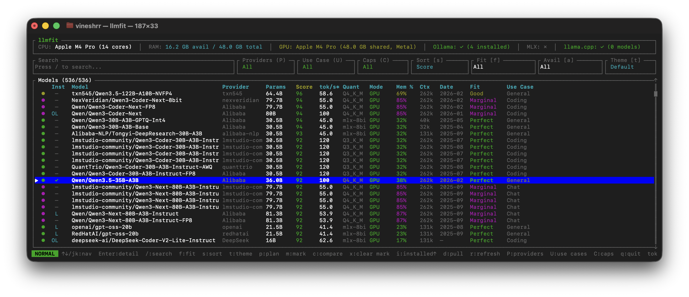
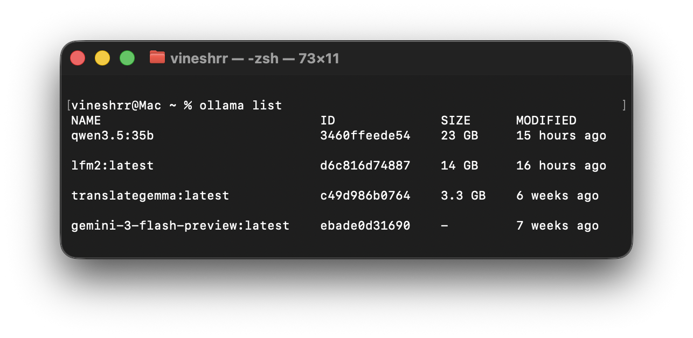
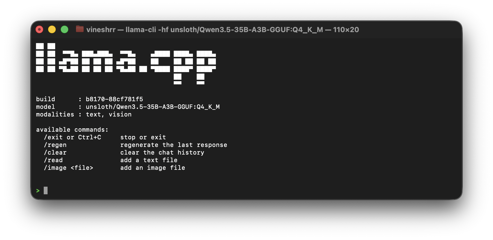
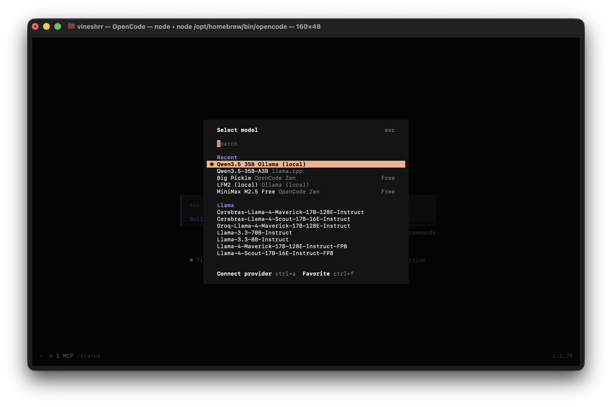

I’ve been experimenting with a local coding setup because models are getting small enough to run on consumer hardware while retaining intelligence like hosted models. Also, it's getting expensive for the amount of [Dragon Riding](https://www.thevinesh.com/posts/dragon_riding_vibe_coding/) I do.

The stack I ended up with is simple:
1. I use [`llmfit`](https://github.com/AlexsJones/llmfit) first to figure out what my machine can realistically handle
1. run the suggested model through either [`Ollama`](https://ollama.com/) or [`llama.cpp`](https://github.com/ggml-org/llama.cpp)
1. and then use [`OpenCode`](https://opencode.ai/) as the interface where I actually work.



## Start with the machine, not the model

For me, `llmfit` is the useful starting point because it makes model selection less hand-wavy. Instead of picking whatever model is currently popular, I can start with what actually fits the hardware I have. That matters more than hype. A model that is technically impressive but awkward on your own machine is not very useful in a real coding workflow.

Right now*, the models I actually keep close are `lfm2:latest` and `qwen3.5:35b` in Ollama, and a `Qwen3.5-35B-A3B-Q4_K_M.gguf` setup on the `llama.cpp` side. That split is useful because it gives me both an easier local serving path and a more direct runtime path depending on what I want to optimize for.
_(*as of 7th Mar 2026.)_

<div style="display:flex; gap:1rem; flex-wrap:wrap; align-items:flex-start; margin:40px 0;">
  
  
</div>

## Ollama and llama.cpp solve different problems

`Ollama` is the easier way to get going: cleaner model management, simpler local serving, and less friction if the goal is to get a usable coding model up quickly. `llama.cpp` is closer to the runtime itself. It gives you more direct control and is better suited if you want to care about quantization, tuning, or getting more out of the hardware. The trade-off is straightforward: `Ollama` is easier to operate, while `llama.cpp` gives you more control.

## OpenCode is where it becomes useful

The way this shows up in my setup is pretty practical. `OpenCode` currently defaults to `ollama/qwen3.5:35b`, but I also have local config for both `ollama` and `llama.cpp`, so I can switch between models when I want to, depending on the task.

Example from my current `OpenCode` setup:

```json
{
  "model": "ollama/qwen3.5:35b",
  "provider": {
    "ollama": { "options": { "baseURL": "http://localhost:11434/v1" } },
    "llama.cpp": { "options": { "baseURL": "http://127.0.0.1:8080/v1" } }
  }
}
```

Once the model is running, `OpenCode` is the part that turns the setup into an actual workflow. I can stop thinking about tokens and just think about what to solve.



What I like about this setup is that each piece has a clear job. Model selection is grounded in hardware, inference stays local, and the coding loop stays close to the machine I’m already working on. I’m not treating this as a claim that local models replace hosted ones for everything. It’s just a practical setup that is easy to reason about, fast to iterate on, and good enough to keep nearby when I want a local coding/co-work partner.